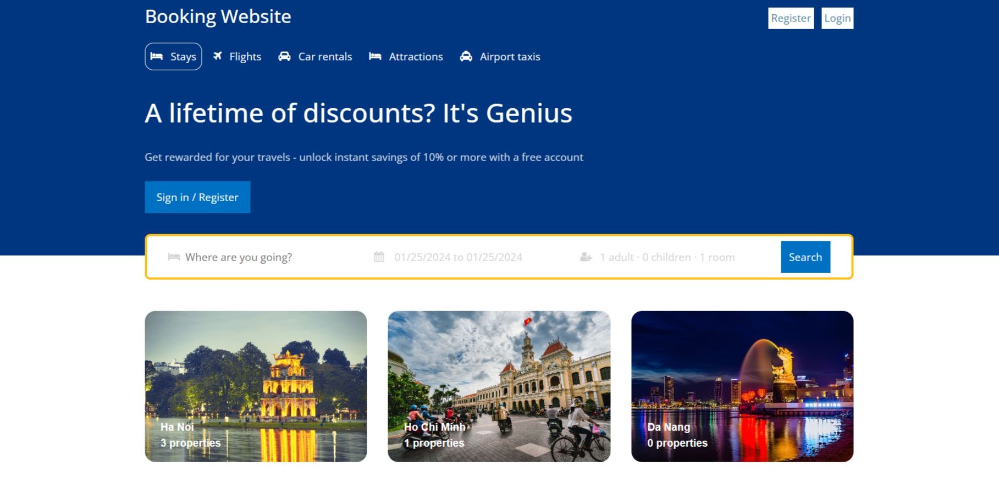

# BOOKING WEBSITE FULLSTACK



## Introduction

This is a project to build a full stack (frontend to backend), hotel booking website.

A place to connect and facilitate the scheduling and booking process for various activities, events, and services. With a simple yet powerful mission of providing an easy and flexible scheduling experience for users.

## Tech Stack

- ReactJS
- React-Router-Dom
- React-Bootstrap
- React Context
- NodeJS & ExpressJS
- MongoDB

## Features

👉 Home Page: Dynamic home page showcases.

👉 Detail Page: Display detailed room information.

👉 Search Page: Engine-based on-demand search.

👉 Transition Page: Track user transactions when booking rooms on the website along with room information.

👉 Admin View Controller: Complete CRUD for hotel rooms detailed profiles with add/edit functions, pagination, and field-specific search.

👉 Responsive: Full responsiveness across devices for consistent user experience; fluid design adapts seamlessly to various screen sizes, ensuring accessibility.

## Quick Start

Follow these steps to set up the project locally on your machine.

**Prerequisites**
Make sure you have the following installed on your machine:

- Git
- Node.js
- npm (Node Package Manager)

**Installation**
Install the project dependencies using npm:

```javascript
npm install
```

**Running the Project**

```javascript
npm run dev
```